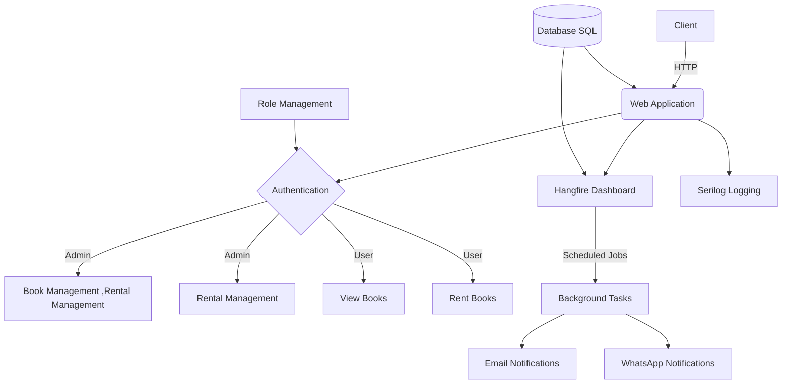

# 📚 Bookify - Advanced Book Rental Management System

<div align="center">


[](https://dotnet.microsoft.com/download)
[](https://docs.microsoft.com/ef/core)
[](https://github.com/mohamedelsaid056/MVC.bookifyapp.aspdotnet)
[](https://github.com/yourusername/bookify/graphs/commit-activity)


</div>




## 📑 Table of Contents
- [Overview](#-overview)
- [System Architecture](#-system-architecture)
- [Features](#-features)
- [Technology Stack](#-technology-stack)
- [Setup Instructions](#-setup-instructions)
- [Project Structure](#-project-structure)
- [Security](#-security)
- [API Documentation](#-api-documentation)
- [Contributing](#-contributing)
- [Deployment](#-deployment)
- [Troubleshooting](#-troubleshooting)
- [License](#-license)
- [Support](#-support)

## 📋 Overview

Bookify is an enterprise-grade book rental management system designed to streamline library operations and enhance user experience. The system provides comprehensive solutions for book inventory management, subscriber handling, rental processing, and administrative operations.

### Key Benefits
- 🎯 Streamlined rental operations
- 📊 Advanced reporting and analytics
- 🔐 Secure user authentication
- 📱 Modern, responsive interface
- 🔄 Real-time updates
- 📈 Scalable architecture

## 🏗 System Architecture


Bookify is a robust ASP.NET Core web application designed for managing book rentals. It features user authentication, book management, and an automated rental system. With integrated Hangfire for background jobs, Serilog for logging, and support for WhatsApp and email notifications, Bookify offers a comprehensive solution for libraries or book rental services.

### Core Features
- 📖 Complete book inventory management
- 📋 Book copy tracking system
- 👥 Subscriber management
- 🔄 Rental processing
- 📊 Reports and analytics
- 👮 Role-based access control
- 🖼️ Image management with Cloudinary
- 📧 Email notifications
- 📱 WhatsApp integration
- 📑 Background job processing with Hangfire
- 📋 Logging with Serilog

## 🔧 Technology Stack

- **Backend Framework**: ASP.NET Core 8.0
- **ORM**: Entity Framework Core
- **Database**: SQL Server
- **Authentication**: ASP.NET Core Identity
- **Frontend**: 
  - Bootstrap
  - jQuery
  - javascript for Ajax calls 
  - DataTables "both client and server"
- **File Storage**: Cloudinary ,
- **Background Jobs**: Hangfire
- **Mapping**: AutoMapper, manual mapping
-  **WhatsApp API** (via IWhatsAppClient)


## 🔐 Security

### Authentication
- ASP.NET Core Identity
- Custom claim providers
- **User Management**: Complete user lifecycle management
- **Password Hashing**: Secure password storage using industry-standard hashing
- **Account Confirmation**: Email verification system
- **Password Recovery**: Secure password reset functionality
- 

### Authorization
#### 1. Role-Based Access Control (RBAC)


```csharp
public static class AppRoles
{
    public const string Admin = "Admin";
    public const string Reception = "Reception";
    public const string Archive = "Archive";
    public const string User = "User";
}

// Controller-level authorization
[Authorize(Roles = AppRoles.Reception)]
public class RentalsController : Controller
{
    // Only the Reception role can access this controller
}

// Action-level authorization
[Authorize(Roles = $"{AppRoles.Admin},{AppRoles.Archive}")]
public IActionResult ManageBooks()
{
    // Only Admin and Archive roles can access this action
}
```


####  Data Protection
using Data protection that built in library .NET 
using extra package "hashids"


#### Security Best Practices
- **HTTPS Enforcement**: All communications are encrypted using SSL/TLS
- **Anti-forgery Tokens**: Protection against CSRF attacks
- **XSS Prevention**: Content security policies and input sanitization
- **SQL Injection Prevention**: Use of parameterized queries and EF Core
- **Secure Headers**: Implementation of security headers (HSTS, X-Frame-Options, etc.)
- **Audit Logging**: Tracking of security-relevant events


## Getting Started

### Prerequisites

- .NET 8.0 SDK or later
- SQL Server 

### Installation

1. Clone the repository
   ```
   git clone https://github.com/yourusername/Bookify.git
   ```

2. Navigate to the project directory
   ```
   cd Bookify
   ```

3. Restore dependencies
   ```
   dotnet restore
   ```

4. Update the connection string in `appsettings.json` to point to your database

5. Apply migrations to create the database
   ```
   dotnet ef database update
   ```

6. Run the application
   ```
   dotnet run
   ```

## Configuration

- The application uses `appsettings.json` for configuration. Make sure to update any necessary settings, such as connection strings, API keys, etc.
- Serilog is configured to read from the configuration file.
- Hangfire dashboard is accessible at `/hangfire` and is restricted to admin users only.

## Scheduled Tasks

The application uses Hangfire to run the following recurring jobs:

- `PrepareExpirationAlert`: Runs daily at 2 PM
- `RentalsExpirationAlert`: Runs daily at 2 PM

## Security

- HTTPS is enforced in production
- X-Frame-Options header is set to "Deny"
- Custom authorization is implemented for the Hangfire dashboard

## Contributing

Please read [CONTRIBUTING.md](CONTRIBUTING.md) for details on our code of conduct, and the process for submitting pull requests.


This project is licensed under the [MIT License](LICENSE).


## Acknowledgments

- [Hangfire](https://www.hangfire.io/) for background job processing
- [Serilog](https://serilog.net/) for structured logging

<div align="center">
Made with ❤️ by the Bookify Team
</div>


