```mermaid
graph TD
    A[Bookify] --> B[User Management]
    A --> C[Authors]
    A --> D[Subscribers]
    A --> E[Books]
    A --> F[Rentals]
    A --> G[Search]

    B --> B1[Add User]
    B --> B2[Update User]
    B --> B3[Delete User]
    B --> B4[Manage User Roles]

    C --> C1[Add Author]
    C --> C2[Update Author]

    D --> D1[Add Subscriber]
    D --> D2[Send Welcome Email]
    D --> D3[Update Subscriber]
    D --> D4[Block Subscriber]
    D --> D5[Subscriber Profile]
    D --> D6[Subscriber Rental History]

    E --> E1[Add Book]
    E --> E2[Update Book]
    E --> E3[Allow/Disallow Rentals]
    E --> E4[Copies]
    E4 --> E4a[Add Copy]
    E4 --> E4b[Update Copy]
    E4 --> E4c[Allow/Disallow Rentals]
    E4 --> E4d[Copy Rental History]

    F --> F1[Add Rental]
    F --> F2[Send Rental Email]
    F --> F3[Update Rental]
    F --> F4[Cancel Rental]
    F --> F5[Rental Returns]
    F --> F6[Send Remainder Email]
    F --> F7[Delay Penalties]
```

# Bookify

Bookify is a robust ASP.NET Core web application designed for managing book rentals. It features user authentication, book management, and an automated rental system. With integrated Hangfire for background jobs, Serilog for logging, and support for WhatsApp and email notifications, Bookify offers a comprehensive solution for libraries or book rental services.

## Features

- User authentication and authorization using native identity pages 
- Book management
- Rental system
- Automated tasks using Hangfire (background jobs)
- Logging with Serilog
- WhatsApp integration
- Email notifications

## Technologies Used

- ASP.NET Core
- Entity Framework Core
- Identity Framework
- Hangfire
- Serilog
- WhatsApp API (via IWhatsAppClient)

## Getting Started

### Prerequisites

- .NET 8.0 SDK or later
- SQL Server 

### Installation

1. Clone the repository
   ```
   git clone https://github.com/yourusername/Bookify.git
   ```

2. Navigate to the project directory
   ```
   cd Bookify
   ```

3. Restore dependencies
   ```
   dotnet restore
   ```

4. Update the connection string in `appsettings.json` to point to your database

5. Apply migrations to create the database
   ```
   dotnet ef database update
   ```

6. Run the application
   ```
   dotnet run
   ```

## Configuration

- The application uses `appsettings.json` for configuration. Make sure to update any necessary settings, such as connection strings, API keys, etc.
- Serilog is configured to read from the configuration file.
- Hangfire dashboard is accessible at `/hangfire` and is restricted to admin users only.

## Scheduled Tasks

The application uses Hangfire to run the following recurring jobs:

- `PrepareExpirationAlert`: Runs daily at 2 PM
- `RentalsExpirationAlert`: Runs daily at 2 PM

## Security

- HTTPS is enforced in production
- X-Frame-Options header is set to "Deny"
- Custom authorization is implemented for the Hangfire dashboard

## Contributing

Please read [CONTRIBUTING.md](CONTRIBUTING.md) for details on our code of conduct, and the process for submitting pull requests.


This project is licensed under the [MIT License](LICENSE).


## Acknowledgments

- [Hangfire](https://www.hangfire.io/) for background job processing
- [Serilog](https://serilog.net/) for structured logging


